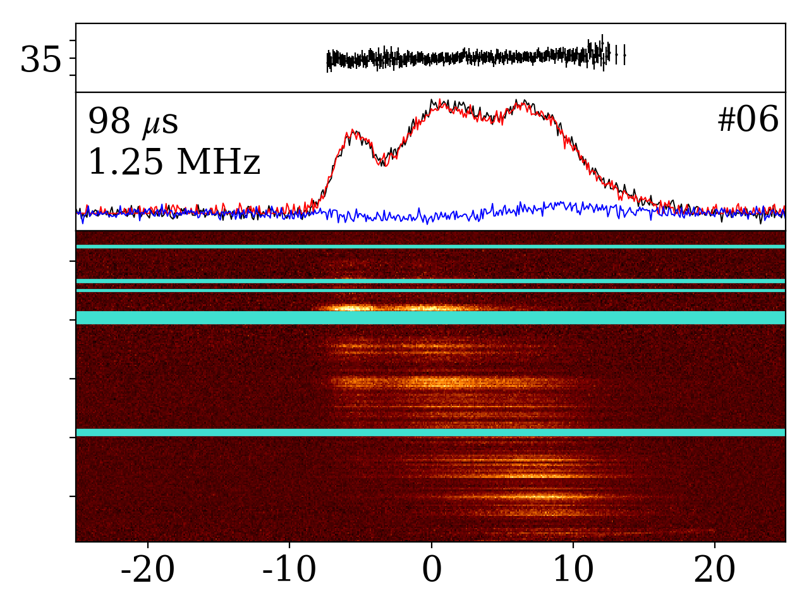

## Archive plotter

Take your archive out for a nice spa day and it can look like this

This started out as a simple plotting tool to make the burst
family portrait in [this paper](https://ui.adsabs.harvard.edu/abs/2021arXiv210712892H/abstract). However, over time I wanted to add more and more
things, like printing statistics or saving dynamic spectra/time series,
so this became the beast it is today. It can be non-trivial to make it
do what you want, but hopefully the help function can guide you towards
victory!
